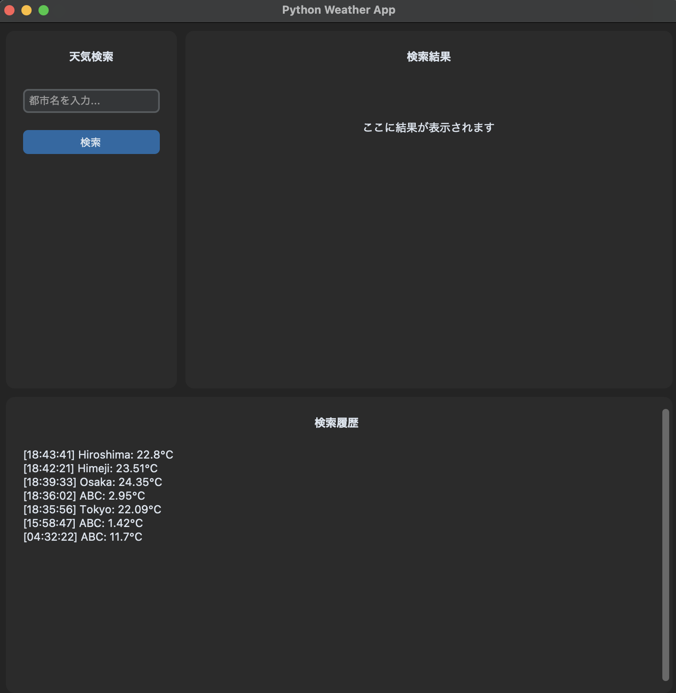

# Python Weather App

Python学習およびポートフォリオ作成を目的として開発した、GUIベースの天気情報取得アプリケーションです。

Python3エンジニア認定実践試験の学習範囲を、外部API・GUI・データベースを利用した実践的なアプリケーション開発を通して体系的に学ぶことを目的として作成しました。

---

## 概要

OpenWeather APIから取得した天気情報をGUI上で表示するデスクトップアプリケーションです。

API通信、JSON解析、SQLiteによる検索履歴管理、ログ出力、GitHub ActionsによるCI環境を実装しています。

また、CustomTkinterによるモダンなGUI、責務分離（Service・Repository）、依存性注入（DI）を採用し、保守性・拡張性を意識した設計を行いました。

---

## 主な機能

* 都市名による天気検索
* OpenWeather APIとのHTTP通信
* JSONレスポンス解析
* 現在の気温・湿度・天気情報表示
* 摂氏・華氏変換表示
* SQLiteによる検索履歴保存
* 検索履歴一覧表示
* datetime・zoneinfoによる取得日時管理
* loggingによるログ出力
* デコレータによる処理時間計測・操作ログ出力
* Dependency Injection（DI）
* RepositoryパターンによるDB管理
* GitHub ActionsによるCI

---

## Screenshots

### Main Window



---

## 使用技術

| 分類                    | 技術             |
| --------------------- | -------------- |
| Language              | Python 3.13    |
| Package Management    | uv             |
| GUI                   | CustomTkinter  |
| HTTP Client           | httpx          |
| Database              | SQLite3        |
| Environment Variables | python-dotenv  |
| Testing               | Pytest         |
| Linter                | Ruff           |
| Type Check            | Mypy           |
| CI/CD                 | GitHub Actions |

---

## ディレクトリ構成

```text
weather_app/
├── database/
│   └── weather_repository.py
├── gui/
│   └── app.py
├── models/
│   └── weather.py
├── services/
│   └── weather_service.py
├── utils/
│   ├── decorators.py
│   └── logger.py
└── main.py

tests/
├── test_weather.py
├── test_weather_repository.py
└── test_weather_service.py

logs/
```

---

## 前提環境

* Python 3.13以上
* uv
* OpenWeather API Key

uvがインストールされていない場合は以下を実行してください。

```bash
pip install uv
```

---

## インストール

```bash
git clone <repository-url>
cd Python-Weather-App

uv sync
```

---

## 環境変数

プロジェクトルートに `.env` ファイルを作成してください。

```env
OPENWEATHER_API_KEY=your_api_key
```

---

## 起動方法

```bash
uv run python -m weather_app.main
```

---

## 品質管理・テスト

### テスト実行

```bash
uv run pytest
```

### Ruff

```bash
uv run ruff check .
```

### Mypy

```bash
uv run mypy .
```

---

## GitHub Actions (CI)

GitHub Actionsを利用したCIパイプラインを構築しています。

ジョブを以下の2段階に分離し、静的解析に成功した場合のみテストを実行する構成としています。

### 1. Lint Job

* Ruff
* Mypy

### 2. Test Job

* Pytest

```yaml
test:
  needs: lint
```

上記により、Lintエラーが発生した場合は不要なテスト実行をスキップできます。

---

## テスト内容

### Weatherモデル

* Weatherオブジェクト生成
* 摂氏→華氏変換
* datetime管理
* doctest

### WeatherService

* API通信
* JSON解析
* エラー処理
* unittest.mockによるAPIモック

### WeatherRepository

* SQLite保存
* SQLite読込
* インメモリSQLiteテスト
* Repository動作確認

### 異常系

* API通信失敗
* HTTPステータスエラー
* データベースエラー
* 不正入力時の動作確認

---

## 学習テーマ

本プロジェクトでは以下の技術要素を重点的に学習・実践しました。

### Python基礎

* dataclass
* datetime
* zoneinfo
* JSON
* SQLite3
* pathlib
* 例外処理

### 実践機能

* HTTP API通信（httpx）
* CustomTkinter
* logging
* デコレータ
* functools.wraps
* *args / **kwargs
* デコレータ適用順
* 型ヒント
* Dependency Injection（DI）
* Repositoryパターン

### 開発プロセス

* pytest
* doctest
* unittest.mock
* GitHub Actions
* Ruff
* Mypy
* リファクタリング
* 責務分離

---

## 今後の改善案

* pytest-covによるカバレッジ測定
* 非同期API通信（async/await）
* 天気アイコン表示
* 5日間天気予報対応
* お気に入り都市登録
* Docker対応
* パッケージ化（PyPI公開）

---

## License

MIT License
